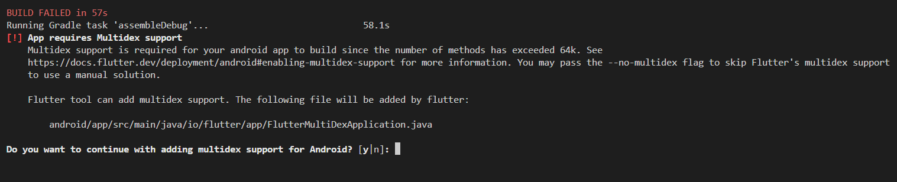

# notes
Notes APP menggunakan Firebase Firestore

## Getting Started
- Buat project firebase console dan aktifkan layanan firestore
- Jalankan ``flutterfire configure`` untuk membuat ``firebase_options.dart``

## Firebase Storage
- Aktifkan layanan firebase storage pada project firebase console 

## Running the app
- Jalankan pada perangkat android atau gunakan emulator
- Jika ingin menjalankan project pada browser gunakan command ``flutter run --web-renderer html``
- Tekan ``y`` jika muncul pesan error seperti ini saat menjalankan aplikaasi di android atau emulator
